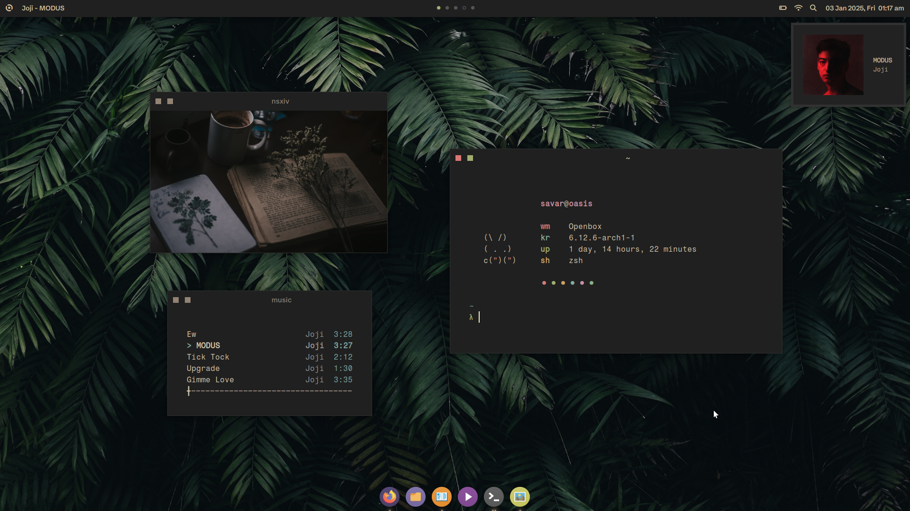
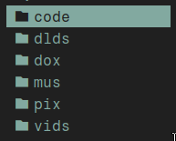

<div align=center>

<div align=center>
<h1>~/dotfiles</h1>

</div>
<br><br>

&ensp;[<kbd> <br> Gallery <br> </kbd>](#Screenshots)&ensp;
&ensp;[<kbd> <br> Overview <br> </kbd>](#Overview)&ensp;
&ensp;[<kbd> <br> Install <br> </kbd>](#Installation)&ensp;
<br><br>
</div>

# Chastity
MacOS inspired Openbox™ rice. Reddit [post](https://www.reddit.com/r/unixporn/comments/1hs2pm8/openbox_chastity/).  
## Screenshots
<div align=center>
<!---->


</div>

# Other Rices
## dwm
My [dwm build](https://github.com/savar95x/dwm), and my current daily driver.  
A productive version of my Chastity rice.  
<div align=center>


</div>

## Sky
An older rice of mine with dwm.  
Works mostly the same as the above one, just the aesthetics (mainly the dwmblocks) are different.  
<div align=center>


</div>

## Pome 2.0
My daily driver before chastity using [BerryWM](https://github.com/savar95x/berry). Reddit [post](https://www.reddit.com/r/unixporn/comments/1dh09dh/berry_pome_20/).  
<div align=center>


<!--img src=.assets/pome2.0/show3.png />


</div>

## Pome
Made using [2bWM](https://github.com/savar95x/2bwm). Reddit [post](https://www.reddit.com/r/unixporn/comments/16ipnru/2bwm_its_pome_again/).  
2bwm is doesnt seem to be very power efficient so not recommended.  
<div align=center>


</div>

<br>

> [!NOTE]
> My older rices (endless on dwm, and dkwm) would be in my [junkyard](https://github.com/savar95x/junkyard) and [dwm](https://github.com/savar95x/dwm) repo.

# Overview
## Dependencies
| Type | Software/Packages |
| --- | --- |
| terminal | [st](https://github.com/savar95/st) |
| shell | zsh zsh-syntax-highlighting |
| editor | neovim |
| file manager | lf bat ueberzug |
| window manager | openbox obconf lxappearance xorg-server xorg-xinit |
| app launcher | rofi |
| bar, dock | polybar plank |
| browser | firefox |
| image viewer | nsxiv |
| document reader | sioyek |
| video player | mpv |
| music | mpd ncmpcpp |
| torrent | transmission tremc |
| font management | gucharmap |

## Directory Structure and Whereabouts

```bash
$HOME
├── .config
├── .local
│   ├── share
│   │   ├── fonts
│   │   ├── icons # ~/.icons is linked to here
│   │   ├── themes # ~/.themes is linked to here
│   │   └── music
│   │       ├── playlists
│   │       └── lyrics
│   ├── scripts # shell scripts
│   └── bin # local binaries
├── code
├── dlds
├── dox
│   └── quotes # quote script fetches from here
├── mus
│   ├── **/*.mp3
│   └── dlmus # download music script
├── pix
│   ├── scrots # screenshots
│   └── assets
│       └── icons # icons for notifications
└── vids
    └── watch_later # watchvid script downloads here using yt-dlp
```

## Keybindings
Read through ~/.config/openbox/rc.xml for more shortcuts.  
| Keybind | Function |
| --- | --- |
| `MOD` + `Enter` | Launch terminal (st) |
| `MOD` + `Q` | Close window |
| `MOD` + `{H,J,K,L}` | Move the window to {Left, Down, Up, Right} |
| `MOD` + `Shift` + `{H,J,K,L}` | Resize the window |
| `MOD` + `Shift` + `F` | Monocle a window |
| `MOD` + `F` | Fullscreen a window |
| `MOD` + `P` | Open app launcher |
| `MOD` + `S` | List out the useful scripts in ~/.local/scipts/ in rofi |
| `MOD` + `Shift` + `S` | Take Screenshot (using maim and slop) |
| `MOD` + `R` | Open lf (terminal file manager) |

Note: `MOD` is the windows key

# Installation
I am working on a script, but till it's done, you'll have to follow the steps manually. Create an issue if you encounter a problem.  
### 1. Install the Dependencies  
This command is for arch. You'll have to search the corresponding package names yourself for the package manager you use.  
```bash
paru -S zsh zsh-syntax-highlighting neovim lf bat xorg-server xorg-xauth xorg-xinit openbox obconf lxappearance ueberzug redshift rofi firefox nsxiv sioyek mpv mpd ncmpcpp transmission-cli tremc-git gucharmap polybar plank xorg-xset xorg-xrdb xorg-xsetroot xorg-setxkbmap xclip maim slop dunst libnotify imagemagick xcolor xdo xdotool wmctrl light pamixer pulsemixer stow ffmpeg ffmpegthumbnailer cronie
```
Search for packages in your package manager.  
```bash
$ apt search "<string you want to query>"
$ xbps-query -Rs "<string you want to query>"
$ pacman -Ss "<string you want to query>"
```

### 2. Clone the Repo
Clone the repo into `~/.local/repos/`. Change this directory to your liking, but make sure it is somewhere organised.  
```bash
mkdir -p ~/.local/repos
cd ~/.local/repos
git clone https://github.com/savar95x/dotfiles
cd dotfiles
```

### 3. Symlink Dotfiles
This will backup conflicting configs and symlink my dots instead.  
```bash
./linkdots.sh
```

### 4. Build and install Binaries
> [!IMPORTANT]
> Build and install at least the **Terminal**, rest are optional  

<details open>
<summary><b>Terminal</b> (st)</summary>
<br>

```bash
git clone https://github.com/savar95x/st
cd st
./compilest
cd ..
```

</details>

<details>
<summary><b>auto-cpufreq</b></summary>
<br>

```bash
git clone https://github.com/AdnanHodzic/auto-cpufreq
cd auto-cpufreq
./auto-cpufreq-installer
cd ..
```

</details>

<details>
<summary><b>yt-dlp</b></summary>
<br>

```bash
curl -LO https://github.com/yt-dlp/yt-dlp/releases/download/2024.12.23/yt-dlp
chmod +x ./yt-dlp
mv yt-dlp ~/.local/bin/
```

</details>

<details>
<summary><b>spotdl</b> (in a virtual env)</summary>
<br>

```bash
python -m venv ~/.local/venv
~/.local/venv/bin/python -m pip install --upgrade pip
~/.local/venv/bin/pip install spotdl
```

</details>

<details>
<summary><b>gotop</b></summary>
<br>

```bash
curl -LO https://github.com/cjbassi/gotop/releases/download/3.0.0/gotop_3.0.0_linux_amd64.tgz
tar xvf gotop_3.0.0_linux_amd64.tgz
chmod +x ./gotop
mv gotop ~/.local/bin/
rm gotop_3.0.0_linux_amd64.tgz
```

</details>

<details>
<summary>more</summary>
<br>

```bash
sudo pacman -S hugo syncthing zed
```

</details>

### 5. Drivers and Audio
> [!NOTE]
> Ignore this if you use user-friendly distros
```bash
sudo pacman -S xf86-input-libinput mesa vulkan-intel intel-media-driver
```
```bash
sudo pacman -S pipewire wireplumber bluez bluez-utils sof-firmware
```

### 6. Theme, Icons and Fonts
```bash
mkdir -p ~/.local/share/themes
ln -s ~/.local/share/themes ~/.themes
mkdir -p ~/.local/share/icons
ln -s ~/.local/share/icons ~/.icons
mkdir -p ~/.local/share/fonts
```
  
<br>

Icon pack is [Numix circle](https://github.com/numixproject/numix-icon-theme-circle). Clone this into ~/.icons/  
GTK theme is [Gruvbox Material](https://github.com/TheGreatMcPain/gruvbox-material-gtk). Clone this into ~/.theme/  
Cursor is [Simp1e](https://www.gnome-look.org/p/1932768). Extract and copy this into ~/.icons/ as well.  

Once copied, you can set these using `lxappearance`.  

Openbox theme is mine. `cd` into `dotfiles/`.  
```bash
cp -r .assets/chastity/gruvopenbox ~/.themes/gruvbox
```
Set it using `obconf`.  

The fonts I use are [Schibsted Grotesk](https://fonts.google.com/specimen/Schibsted+Grotesk), [Inter](https://fonts.google.com/specimen/Inter), and [Fragment Mono](https://uncut.wtf/monospace/fragment-mono/). Polybar icons are from [nerd fonts symbols](https://github.com/ryanoasis/nerd-fonts/releases/download/v3.3.0/NerdFontsSymbolsOnly.zip) and [font awesome](https://fontawesome.com/download). Make sure their files (.ttf or .otf) are extracted (somewhere) in ~/.local/share/fonts/  

Run this once after extracting fonts  
```bash
fc-cache -fv
```

### 7. Notification Icons
<div>
  
&nbsp;&nbsp;
  
&nbsp;&nbsp;
  
&nbsp;&nbsp;
  
&nbsp;&nbsp;
  
</div>
<br>

`cd` into the `dotfiles/` directory.  
```bash
mkdir -p ~/pix/assets
cp -r .assets/icons ~/pix/assets/icons
```
This directory has been hardcoded for now, I am yet to update the scripts to use `$XDG_PICTURES_DIR` instead of `~/pix`.  
You can of course change them yourself if you'd like.  

### 8. Periodic Notifications (using cronjob)
  

Enable `cronie`.  
```bash
sudo systemctl enable cronie
```
Type `crontab -e` in the command-line and add the following line  
```bash
# periodic notifications
30 * * * * ~/.local/scripts/health
0 */2 * * * ~/.local/scripts/quote
```
For cron to be able send notifications, it needs the active session's dbus ID, which has been taken care of by producing `~/.dbus/Xdbus` while logging into openbox ;)  

### 9. Change Default Shell to zsh
```bash
ln -s ~/.config/zsh/rc ~/.zshrc
ln -s ~/.config/zsh/profile ~/.zprofile
chsh -s /usr/bin/zsh
```

# Launching
> [!CAUTION]
> If your system somehow manages audio, you might consider commenting the `audio_server.sh` command in `~/.zprofile`  

If you do not use a display manager, openbox should launch itself when you login from tty1 with zsh as the default shell.  
If it doesn't, something might be wrong, check if you linked .zprofile.  
You can try doing this though  
```bash
[ -f ~/.xinitrc ] && mv ~/.xinitrc ~/.config.bak/
ln -s ~/.config/x11/openbox ~/.xinitrc
```
Then run  
```bash
startx
```


<!--
### TODO
- [ ] Improve install instructions
- [ ] Add fonts, simp1e-cursor, gruvbox-material-gtk (via links and downloading).
- [ ] Fix some shortcuts (like in file manager) being username dependent.
- [ ] Add quality of life stuff like syncthing, downloader-cli, sof-firmware, spotdl (via links and downloading).
- [ ] rofi -show window with hidden windows for quicknote/lofi_music to work
-->

<!--
- [ ] Check out [larbs](https://larbs.xyz) to realise how he does it.
### Thanks
- voldemort(pentest2k) from discord or [KT-Chovy](https://reddit.com/u/KT-Chovy) for bearing every small improvement I made with the rice
- [Elkowar](https://github.com/elkowar/) for making me believe gruvbox can be aesthetic as well
- [adi1090x](https://github.com/adi1090x/) for his rofi configs
-->

**todo for myself**  
push transmission-daemon and redshift config from older laptop  
also, backup the hugo precompile directory somehow  
